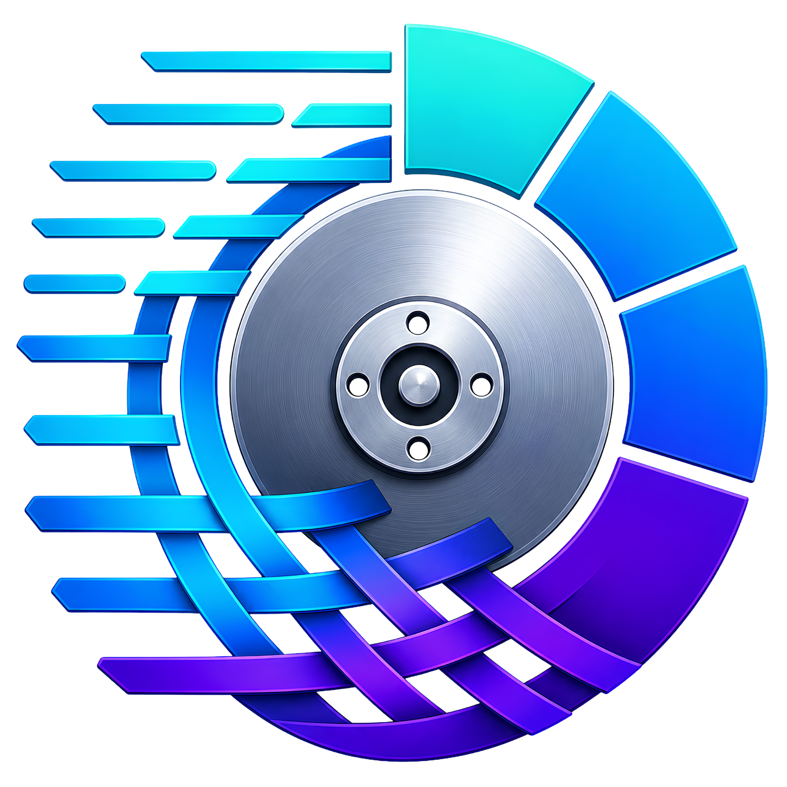

# DiskLoom 

See your disk clearly.

DiskLoom is an open-source Windows disk space analyzer for quickly finding what is using storage and cleaning it up. It includes a polished desktop app for visual browsing and a fast `dlm` CLI for terminal scans, CSV export, and automation.

## Download

- Website: <https://blu3ph4ntom.github.io/diskloom/>
- Latest release: <https://github.com/Blu3Ph4ntom/diskloom/releases/latest>
- Installer: `DiskLoomSetup-x64.exe`
- Portable build: `diskloom-portable-windows-x64.zip`

The installer installs:

- `diskloom.exe`: the Windows desktop app.
- `dlm.exe`: the command-line scanner, added to PATH.

## App

Open DiskLoom, choose a drive or enter a path, then browse the largest folders and files in one screen. The app is designed for fast cleanup work: scan, sort, inspect, open in Explorer, and delete to Recycle Bin.

DiskLoom uses direct NTFS metadata scanning when Windows allows raw volume access. Folder scans and non-NTFS locations use fallback traversal. The app has no telemetry and no background service.

## CLI

Run a scan in the current directory:

```powershell
dlm
```

Scan a drive or folder:

```powershell
dlm C:\
dlm C:\Users --limit 25
```

Force fallback traversal:

```powershell
dlm . --scanner fallback --limit 25
```

Export CSV:

```powershell
dlm C:\Users --csv users.csv
```

Show file type statistics:

```powershell
dlm C:\Users --file-types
```

Show duplicate candidates:

```powershell
dlm C:\Users --duplicates --limit 25
```

List Windows volumes:

```powershell
dlm volumes
```

Direct NTFS scans can require administrator access. Explicit `--scanner fallback` stays non-admin.

## Build From Source

Requirements:

- Windows
- Rust stable
- Node.js 22+
- npm

Build the app:

```powershell
npm install --prefix frontend
npm run build --prefix frontend
cargo build --release --locked
```

Build the installer:

```powershell
.\scripts\package-installer.ps1
```

Build the portable package:

```powershell
.\scripts\package-portable.ps1
```

## Contribute

DiskLoom is Rust-first and Windows-first. Scanner logic is kept independent from the UI, and large-file data structures should stay compact enough for millions of entries.

Good contribution areas:

- Scanner correctness and edge cases.
- Lower memory use during large scans.
- UI responsiveness and cleanup workflows.
- CLI output, filters, and export behavior.
- Benchmarks and reproducible test datasets.

Before opening a pull request:

```powershell
cargo fmt --all --check
cargo test --workspace --locked
cargo clippy --workspace --all-targets --locked -- -D warnings
```

## License

MIT. See [LICENSE-MIT](LICENSE-MIT).
